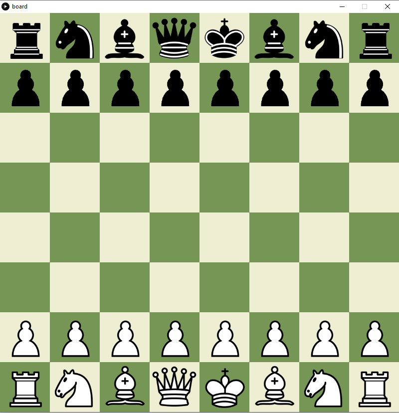

# ChessGame
This is a digital chess game. With the ability to play against another user on the same computer. The game is programmed using Java.

To move a piece click and hold on that piece and then move it to the requested square, out of the ones that are allowed.

# How to build
The chess game uses Processing 3 to run, which means that to play this game you need Processing 3 (or a later version) downloaded on your computer. To open the game, clone this repo and open 'board.pde' in Processing 3 and run it. You do not need anything other than Processing 3
to run this game.

# Commands
* Restart - To restart the game press "r"
* Undo - To undo the latest move press "b" (observe that only the latest move can be undone)
* Quit - To quit the game press "q"

# MVP
Our MVP is a functioning chess game without any special features. This means that the program will not warn when in check och check-mate, but this chess game functions more as real physical chess game. Observe that illegal moves will be drawn on the board. Also, en passant and castling will not be built in. Promoting pawns is also not something that can be done.

